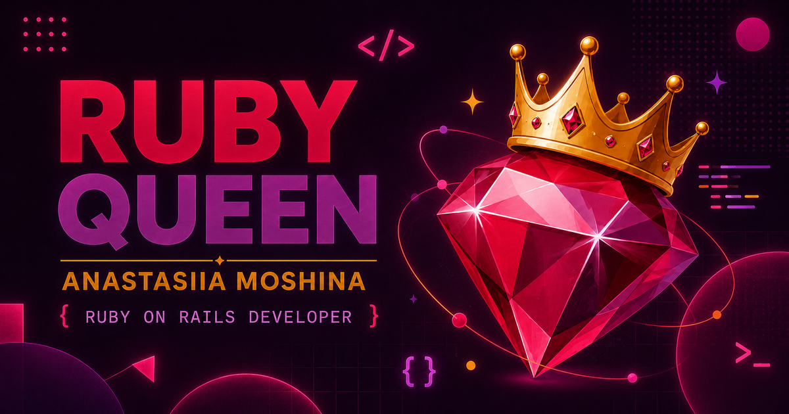

<div align="center">



# Ruby Queen

**A bilingual (RU/EN) personal portfolio for a Ruby on Rails developer.**

[](https://github.com/moshinaan/ruby-queen-portfolio/actions/workflows/rubyonrails.yml)


</div>

---

## Overview

A single-page portfolio site — hero, about, stack, experience, projects and
contact — rendered server-side with Rails and `I18n`, with just enough
Hotwire/Stimulus and Turbo for smooth in-page navigation. No JS framework,
no API, no database: content lives in view partials and locale files.

## Tech stack

| Layer         | Tools                                             |
| ------------- | -------------------------------------------------- |
| Backend       | Ruby 4.0.5, Rails 8, Puma                          |
| Frontend      | Hotwire (Turbo + Stimulus), Importmap, Propshaft   |
| i18n          | Rails `I18n`, `config/locales/{en,ru}.yml`          |
| Data          | SQLite                                              |
| Deployment    | Docker                                              |
| CI            | GitHub Actions — tests, RuboCop, Brakeman, bundler-audit |

## Getting started

```bash
bundle install
bin/rails server
```

Open [localhost:3000](http://localhost:3000). Switch languages with the
`RU`/`EN` toggle in the nav — routes stay the same, only `I18n.locale` changes.

## Project structure

```
app/views/home/
├── index.html.erb     # page shell, renders the partials below
├── _nav.html.erb
├── _hero.html.erb
├── _about.html.erb
├── _stack.html.erb
├── _experience.html.erb
├── _projects.html.erb
├── _work.html.erb
└── _contact.html.erb

config/locales/
├── en.yml              # all copy, English
└── ru.yml               # all copy, Russian
```

All page copy lives in the locale files — editing content rarely touches the
`.erb` templates.

## Docker

```bash
docker build -t ruby-queen .
docker run -p 3000:3000 -e SECRET_KEY_BASE=$(bin/rails secret) ruby-queen
```

## Quality checks

```bash
bin/rubocop --parallel   # style (Omakase)
bin/brakeman -q -w2       # static security analysis
bin/bundler-audit --update
```

These are exactly the checks run in CI on every push and pull request.

## Contact

Built by **Anastasiia Moshina** — [moshinaan@gmail.com](mailto:moshinaan@gmail.com) · [Telegram](https://t.me/ruby_queen) · [LinkedIn](https://www.linkedin.com/in/anastasia-moshina/) · [GitHub](https://github.com/moshinaan)
